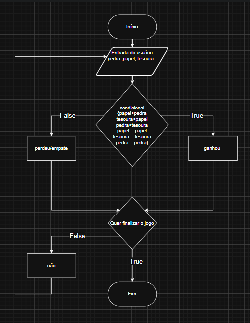

# 🚀 Jogo pedra papel tesoura largato Spock

> Um projeto academico para aprofundamento em python

## 💻 Sobre
Esse projeto tem como finalidade criar um jogo de pedra papel tesoura largato spock versao do Sheldon Cooper na série The Big Bang Theory usando logica computacional.

### Regra do jogo
- Tezoura corta papel
- Papel cobre pedra
- Pedra esmaga lagarto
- Lagarto envenena Spock
- Spock esmaga tesoura
- Tesoura decapita lagarto
- Lagarto come papel
- Papel refuta Spock
- Spock vaporiza pedra
- E como sempre foi, pedra amassa tesoura.

## ✨ Fluxograma


## 🛠 Tecnologias
As principais ferramentas usadas no projeto:
* **Linguagem:** [Python]

## 🚀 Como Rodar
Siga os passos abaixo para ter uma cópia do projeto rodando na sua 
máquina:

### Pré-requisitos
* Python 3.10 ou superior instalado
* Git instalado

### Instalação
1. Clone o repositório:
   ```bash
   git clone [https://github.com/IuryDiasCoelho/ABPJ2_pedra_papel_tesoura](https://github.com/IuryDiasCoelho/ABPJ2_pedra_papel_tesoura)

2. Acesse a pasta do projeto:

   ```bash
    cd ABPJ2_pedra_papel_tesoura
   
3. Execute o programa:

   ```bash
    python pedra_papel_tesoura.py

## 👩‍💻👨‍💻 Autores
Informe:
- Iury Dias Coelho – Desenvolvimento Web e Mobile – Python basico.
